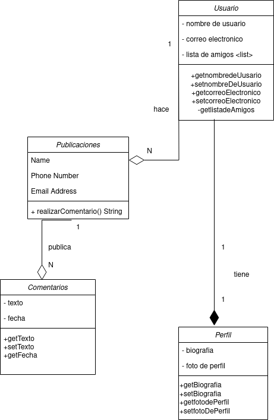

## Diagrama de Clases
### Enunciado
Diseñe un diagrama de clases para un sistema de red social. El sistema debe permitir a los usuarios crear perfiles, publicar contenido, seguir a otros usuarios y dar "me gusta" a las publicaciones. Teniendo en cuenta la siguiente información:

    Representa a los usuarios del sistema, con los siguientes atributos: nombre de usuario, correo electrónico y lista de amigos (Otros usuarios).
    Representa las publicaciones realizadas por los usuarios, con atributos como contenido, fecha de publicación y cantidad de "me gusta". Ten en cuenta que un usuario realizará publicaciones.
    Cada usuario debe de poseer un perfil, que contiene información adicional sobre cada usuario, como la biografía y la foto de perfil.
    Se debe de gestionar la creación de perfiles de usuario, la publicación de contenido y las interacciones entre usuarios.
    Representa los comentarios realizados por los usuarios en las publicaciones, con atributos como texto y fecha. Ten en cuenta que un usuario podrá realizar comentarios sobre las publicaciones.
    Se debe de tener en cuenta los seguidores entre usuarios. Es decir, dos usuarios serán amigos si uno u otro se sigue.

Se pide: 

    Realiza el diagrama de clases del ejercicio. (3,5 puntos)
    Realiza el pseudocódigo de la solución propuesta. (1,5 puntos)
    Realiza la tarea en un README.md y envia la url del repositorio.(0.5 puntos).

### Pseudocódigo 
1. Se crea la clase Usuario con atributos de nombre de usuario y correo electronico, también habrá una lista dinámica que contendrá los amigos (otros usuarios).
1. getnombredeUsuario para obtener el nombre de usuario
2. setnombredeUsuario para editar el nombre de usuario
3. getcorreoElectronico obtiene el correo electrónico al llamarlo
4. setcorreoElectronico edita el atributo de correo electrónico de la clase usuario
5. Si hay un usuario se crea un perfil, relacion 1:1 de composición, creamos la clase Perfil que tendrá los atributos biografía y foto de perfil.
6. getBiografia para obtener la biografia
7. setBiografia para configurar la biografia del perfil
8. getfotodePerfil para obtener la foto de perfil
9. setfotodePerfil para editar la foto de perfil
10. EL usuario hace publicaciones, creamos la clase Publicaciones con los siguientes atributos: contenido, fecha de publicación y cantidad de me gusta.
11. Creamos método realizarComentario() con parámetro de entrada String.
12. Get y set de contenido para obtener la informacion del contenido y/o modificar.
13. Getters de fechaDePublicacion y cantidadMeGusta para obtener el contenido, no hace falta set.
14. En las publicaciones se puede publicar comentarios, creamos la clase comentarios con los siguientes atributos: texto, fecha.
15. get y set de texto para obtener la información y/o editarla.
16. get de la fecha para obtener la fecha de publicación del comentario.

## Diagrama 

