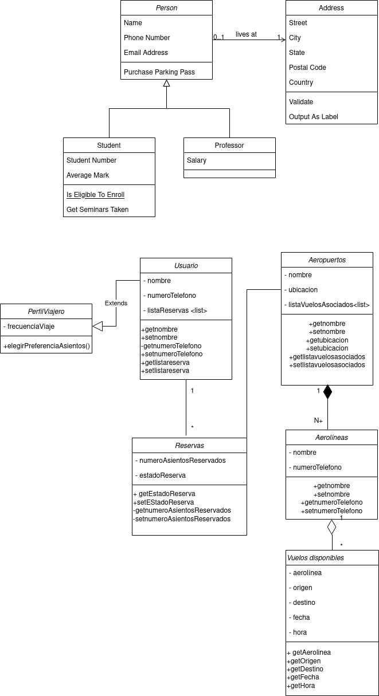

## Diagrama de Clases
### Enunciado 
Diseñe un diagrama de clases para un sistema de reservas de vuelos. El sistema debe permitir a los usuarios buscar vuelos, realizar reservas, gestionar perfiles y visualizar información sobre aerolíneas y aeropuertos. Ten en cuenta la siguiente información:

    Representa a los usuarios del sistema, con atributos como nombre, número de teléfono y lista de reservas.
    Representa los vuelos disponibles, con atributos como aerolínea, origen, destino, fecha y hora.
    Almacena la información de las reservas realizadas por los usuarios, con detalles como el número de asientos reservados y el estado de la reserva.
    Representa las aerolíneas que operan en el sistema, con atributos como nombre y lista de vuelos.
    Representa la información de los aeropuertos, como nombre, ubicación y lista de vuelos asociados.
    Almacena información adicional sobre los usuarios, como preferencias de asientos y frecuencia de viaje, siendo este su perfil.

Se pide:

    Realiza el diagrama de clases del ejercicio. (3,5 puntos)
    Realiza el pseudocódigo de la solución propuesta. (1,5 puntos)
    Realiza la tarea en un README.md y envia la url del repositorio.(0.5 puntos).

### Pseudocódigo
1. El sistema tendrá Usuarios, creamos clase Usuarios con los siguientes atributos: nombre, número de teléfono y una lista dinámica de reservas.
2. Además se tendrá en cuenta información adicional de Perfil de Viajero que se extiende desde la Clase Usuario, por lo que creamos otra clase llamada PerfilViajero con el atributo de frecuencia de viaje y creamos un método de elección de preferencia de asiento.
2. Creamos getters y setters de atributos.
3. Los usuarios realizan reservas, la representamos creando la clase Reservas con los siguientes atributos: numeroAsientosReservados y estadoReserva.
2. Creamos getters y setters de atributos.
4. Creamos clase Aeropuerto con los siguientes atributos: nombre, ubicación y lista dinámica de vuelos asociadoss. 
2. Creamos getters y setters de atributos.
5. Creamos clase Aerolíneas que es composición de Aeropuerto con relación de cardinalidad 1:N (Un aeropuerto tiene de 1 a muchas aerolíneas) con los siguientes atributos: nombre y numerodeTelefono
2. Creamos getters y setters de atributos.
6. Las aerolíneas pueden tener vuelos disponibles, creamos clase Vuelos Disponibles con los siguientes atributos: aerolinea, origen,  destino, fecha y hora. 
2. Creamos getters y setters de atributos.

## Diagrama

